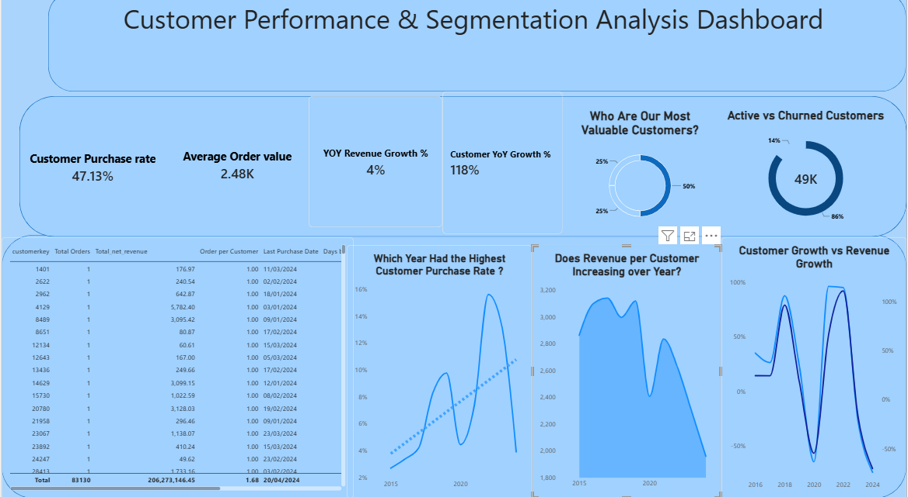

# Customer Analytics Power BI Dashboard

An end-to-end **Power BI customer analytics project** designed to analyze customer behavior, revenue performance, retention, segmentation, and customer value through interactive dashboards.

The project transforms raw sales data into actionable customer insights using **Power BI, Power Query, DAX, and data modeling**.

---

## 📊 Project Overview

Understanding customer behavior is essential for identifying valuable customers, improving retention, and making data-driven business decisions.

This project focuses on answering questions such as:

* How is customer revenue changing over time?
* How many customers are new vs. returning?
* How does customer retention change over the years?
* Which customers are active or churned?
* Which customer segments generate the most revenue?
* What is the Customer Lifetime Value (LTV)?
* How does customer behavior differ across cohorts?
* Does having more customers necessarily lead to higher revenue?

---

## 🎯 Business Objectives

The main objectives of this project are to:

* Analyze customer revenue and purchasing behavior.
* Identify customer growth and retention trends.
* Segment customers based on their purchasing behavior.
* Measure Customer Lifetime Value.
* Identify active and churned customers.
* Analyze customer cohorts and their performance.
* Provide an interactive dashboard for exploring customer insights.

---

## 🛠️ Tools & Technologies

* **Power BI**
* **DAX**
* **Data Modeling**
* **Star Schema**
* **Interactive Data Visualization**

---

## 📈 Dashboard Analysis

### 1. Customer Revenue Analysis

Analyze customer revenue across different years and identify revenue trends and changes in customer contribution 

### 2. Customer Status

Classify customers based on their latest purchasing activity, helping identify **Active** and **Churned** customers.

### 3. Customer Lifetime Value

Analyze the average revenue generated per customer and compare customer value across different segments.

### 4. Cohort Analysis

Customers are grouped based on their first purchase year to analyze how different customer cohorts perform over time.

---

## 📊 Key Metrics

The dashboard includes metrics such as:

* Total Customers
* Total Revenue
* Total Orders
* Average Order Value
* Revenue per Customer
* Customer Retention
* Active Customers
* Churned Customers
* Customer Lifetime Value


---

## 🧮 Data Modeling

The project uses a **Star Schema** to organize the data and improve analytical performance.

The model separates transactional data from descriptive dimensions, allowing the dashboard to efficiently analyze customers, products, sales, and dates.

---

## 🔍 Key Insights

The analysis helps uncover relationships between:

* Customer growth and revenue growth
* Customer retention and revenue performance
* Customer purchasing frequency and lifetime value
* Customer segments and revenue contribution
* Cohort performance over time

One important analytical question explored in the project is:

> **Does acquiring more customers necessarily result in higher revenue?**

---

## 📸 Dashboard Preview

### Customer Overview


### Customer Performance & Segmentation


### Customer Details


---

## 🚀 Project Skills Demonstrated

This project demonstrates practical experience in:

* Data Modeling
* DAX Measures
* Customer Analytics
* Cohort Analysis
* Churn Analysis
* KPI Development
* Interactive Dashboard Design
* Business Insight Generation

---

## 📁 Repository Structure

```text
📁 Repository Structure
Customer-Analytics-Segmentation--Power-BI/
│
├── README.md
│
└── /
    ├── Customer overview.png
    ├── Customer_performance&segmentation.png
    └── Customer_table_Cohort.png
```

---

## 💡 Conclusion

This project provides a comprehensive view of customer behavior and value by combining revenue analysis, retention, segmentation, lifetime value, and cohort analysis into one interactive Power BI solution.

The goal is not only to visualize customer data, but to turn it into **actionable business insights that can support customer-focused decision making**.
