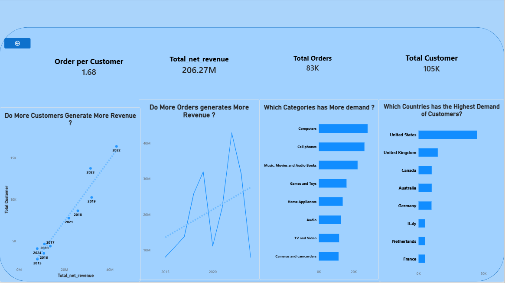
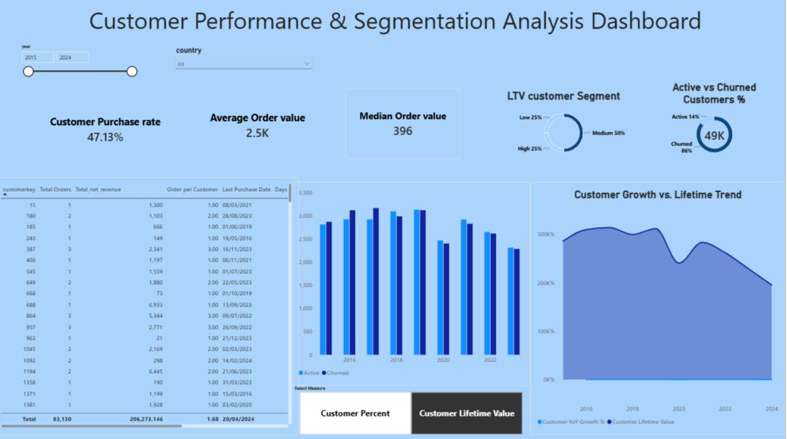
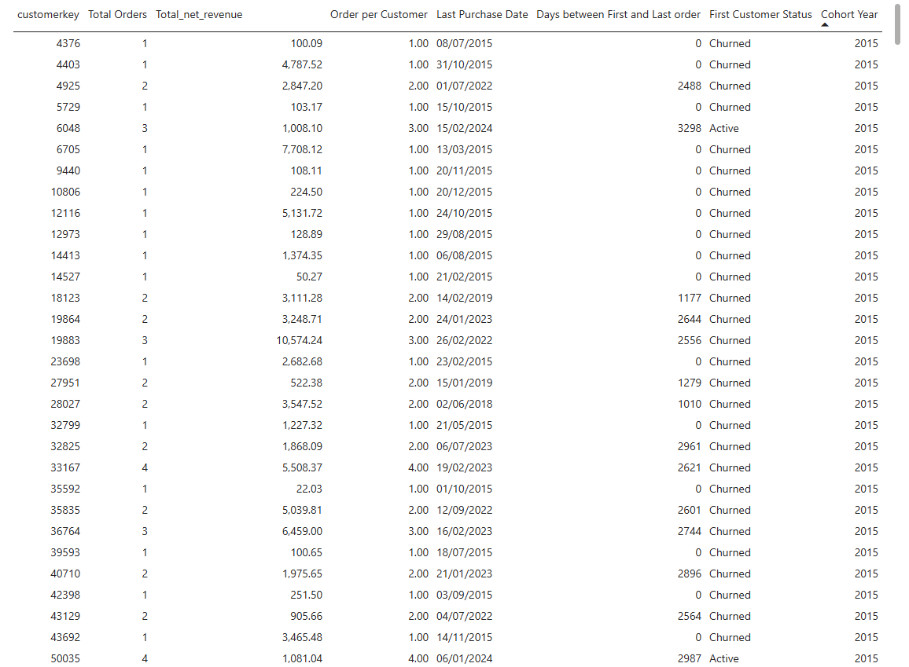
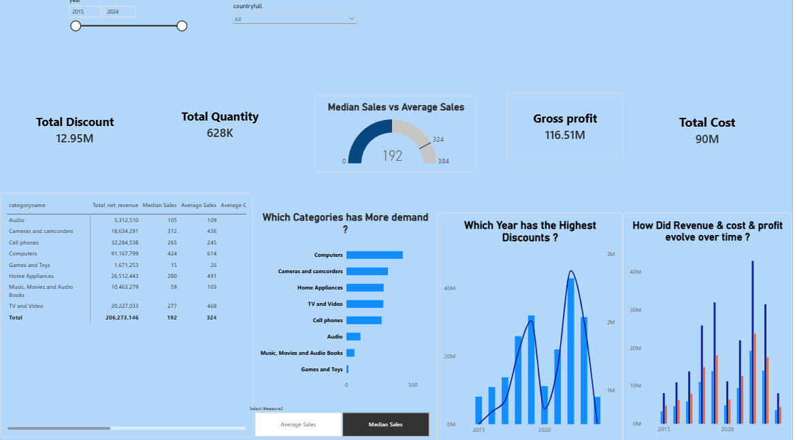

# Customer Analytics Power BI Dashboard

An end-to-end **Power BI customer analytics project** that transforms transactional sales data into actionable insights across **customer behavior, revenue, retention, churn, segmentation, cohorts, and product categories**.

Built using **Power BI, Power Query, DAX, and Star Schema data modeling**.

---

## 📊 Project Overview

The project analyzes transactional sales data to understand **who the customers are, how they purchase, how valuable they are, and how their behavior changes over time**.

The dashboard answers key business questions:

* How are revenue and customer growth changing over time?
* Are customers **Active or Churned**?
* Which customer segments generate the most value?
* How does performance differ across customer cohorts?
* Which product categories perform best?
* How do **Average Sales and Median Sales** compare across categories?
* Does acquiring more customers necessarily lead to higher revenue?

---

## 🛠️ Data Preparation & Modeling

Raw transactional data was transformed using **Power Query** and organized into a **Star Schema** for analysis.

The model connects:

* **Sales** – transactional data
* **Customers** – customer attributes
* **Products** – product and category information
* **Date** – time-based analysis

DAX measures were then created to calculate customer, revenue, sales, and retention metrics.

---

## 📈 Dashboard Analysis

### Customer Performance

Analyzes revenue, customer growth, orders, Average Order Value, and Revenue per Customer over time.

### Customer Status & Churn

Classifies customers as **Active or Churned** based on their latest purchasing activity and a defined six-month inactivity period.

### Customer Segmentation

Segments customers into **Low, Medium, and High LTV** groups to understand customer value and revenue contribution.

### Cohort Analysis

Groups customers by their **first purchase year** to compare customer and revenue performance across cohorts.

### Product Category Analysis

Compares product categories using **Average Sales and Median Sales**, providing a clearer view of typical performance and the effect of high-value transactions.

---

## 📊 Key Metrics

* Total Customers
* Total Revenue
* Total Orders
* Average Order Value
* Revenue per Customer
* Customer Growth
* Revenue Growth
* Active Customers
* Churned Customers
* Customer Lifetime Value
* Average Sales
* Median Sales

---

## 🔍 Key Insights

The analysis highlights that:

* **2020 experienced a significant decline in customer and revenue performance, coinciding with the COVID-19 pandemic and its broader economic impact.**
* **2022 was a strong year for sales performance**, showing a noticeable increase across key sales metrics.
* **2023 saw a decline in Median Sales**, while overall sales performance also decreased across most key metrics.
* Customer growth does not always translate into proportional revenue growth.
* Customer value varies significantly across LTV segments.
* Different acquisition cohorts show different levels of long-term performance.
* **Average and Median Sales reveal different patterns across product categories.**

## 📸 Dashboard Preview

### Customer Overview

### Customer Performance & Segmentation

### Customer Details & Cohort Analysis

### Product Category Details

---

## 🚀 Skills Demonstrated

**Power BI · Power Query · DAX · Star Schema · Data Modeling · Customer Analytics · Revenue Analysis · Churn Analysis · LTV Segmentation · Cohort Analysis · Category Analysis · KPI Development · Data Visualization · Business Insights**

---

## 💡 Conclusion

This project goes beyond simply reporting sales. It connects **customer acquisition, purchasing behavior, retention, customer value, cohort performance, and product categories** to provide a complete view of business performance.

The key takeaway is that **customer quantity alone does not tell the full story** — understanding customer value, retention, purchasing behavior, and sales distribution provides deeper and more actionable insights.
